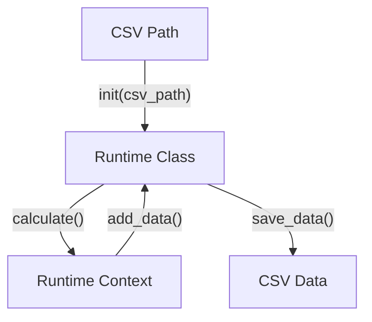

# diagram

```mermaid


graph TD
    csv_data["CSV Data"]
    runtime_class["Runtime Class"]
    runtime_context["Runtime Context"]
    csv_path["CSV Path"]

    csv_path -->|"init(csv_path)"| runtime_class
    runtime_context -->|"add_data()"| runtime_class
    runtime_class -->|"calculate()"| runtime_context
    runtime_class -->|"save_data()"| csv_data


```
