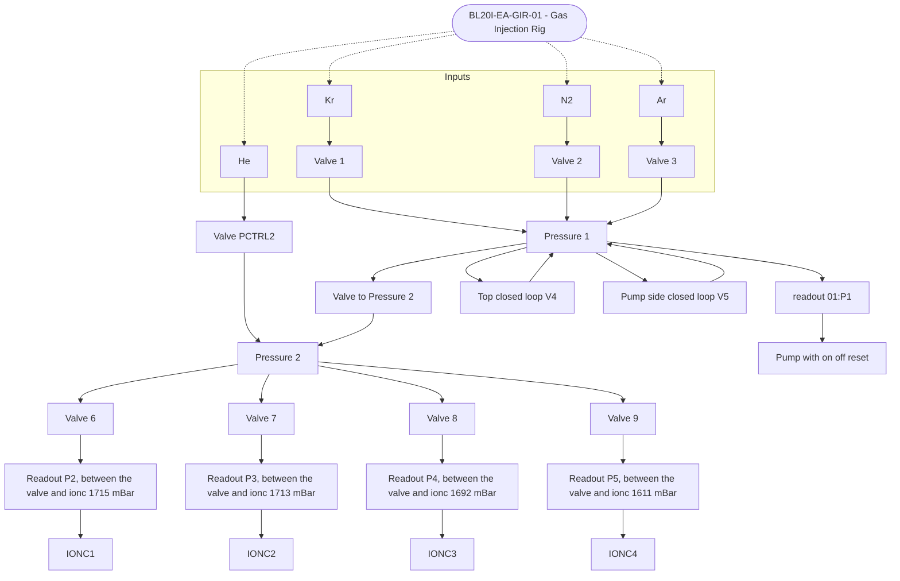

## i0

BL20I-EA-IAMP-01

clibration mode,sensitvity mode
BL20I-EA-IAMP-01:IOUC

## i1

BL20I-EA-IAMP-04

and looks the same as the one above

## it

it's 02

## iref is 03

## table

BL20I-EA-TABLE-02:X.VAL with x, y, sample rotation, fine rotation

also MO-Table-03 with 6 degrees of movement

t1 opticts table EA-01
with x, y

## gas rig

it's opened in a separate window
has a complex diagram to the 4 ion chmbers

the root is BL20I-EA-GIT-01

and six valuves: V3

PCTRL1:SETPOINT:WR for setting argon

for puring
valve V5:CON to 2 to reset line valve
then to 0 then 0 to open

pressure = 01PCTRL1:P:RD

pump on = VACP1:CON set to 0, off to set to 1

v1 is Kr, v2 is N2, V3 is Ar

with .STA

then just some

## diagram

and IONC1 is i0,

BL20I-EA-GIR-01:VACP1:CON is the pump - on, off, reset
