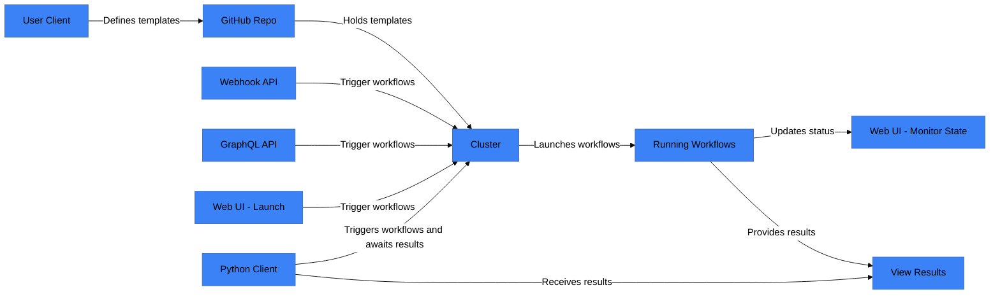

# workflows readme

## how it works



# we use workflows as here

using this visit
cm40636-2

<https://diamondlightsource.github.io/workflows/docs/tutorials/ptypy-workflows/>

## for auth

```export TOKEN=$(kubectl oidc-login get-token --oidc-issuer-url=https://authn.diamond.ac.uk/realms/master --oidc-client-id=workflows-cluster --grant-type=password --oidc-use-access-token | jq -r '.status.token')```

```jq -Rs '{query: .}' test.graphql | \
curl -X POST https://workflows.diamond.ac.uk/graphql \
  -H "Content-Type: application/json" \
  -H "Authorization: Bearer ${TOKEN}" \
  -d @-
```
