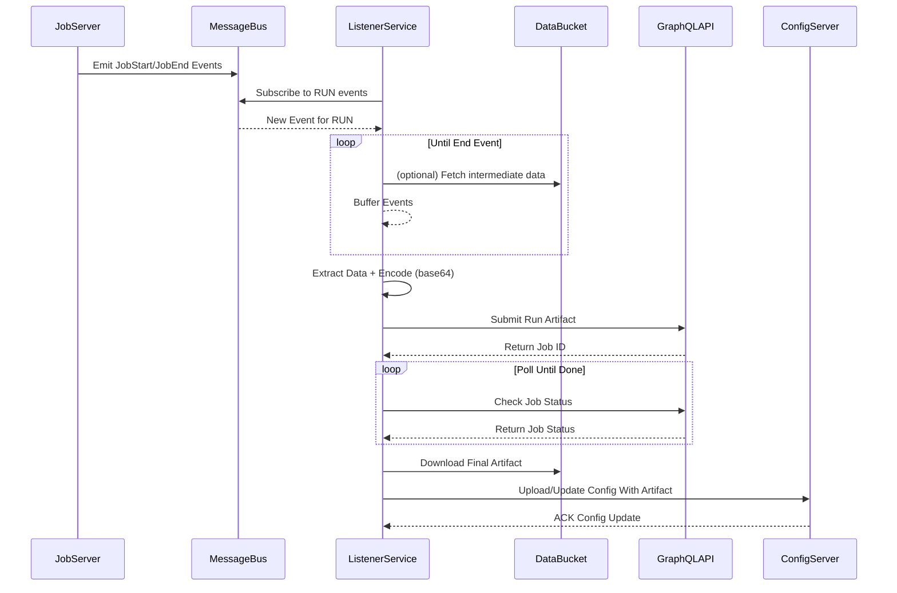

## got it working partway

this is assuming we just read all the steps until the end - so that it is not adaptive
still need the start stop step

podman run -it --network blue-histogramming_default --mount type=tmpfs,target=/tmp   --mount type=bind,src=$(pwd)/workflows/helm/notebooks/,target=/app   --workdir /app   ghcr.io/astral-sh/uv:bookworm  uv run  curve_fitting.py 1 10 1
      Built docopt==0.6.2
Installed 48 packages in 245ms
{}
the above were args, hello world!
Curve fitting not yet implemented
could not connect to host rmq, port 61613
could not connect to host rmq, port 61613
could not connect to host rmq, port 61613
Connection failed. Please check your credentials and server address., error:
Failed to connect to STOMP server.
/app/curve_fitting.py:158: OptimizeWarning: Covariance of the parameters could not be estimated
  parameters_optimal, covariance = curve_fit(
Output: []
/app/curve_fitting.py:170: OptimizeWarning: Covariance of the parameters could not be estimated
  params_optimal_linear, covariance = curve_fit(
📈 Quadratic fit: [ 8.27177395 -0.14286706  6.96625793]
📉 Linear fit:    [ 4.99998372e+00 -4.10953063e-06  3.41280524e-07]

## graph

## run with

`marimo edit curve_fitting.py -- --data="$( <  gaussian_00_base64.txt)" --shape="(100,3)"`

Beware the space and parameter injection.
